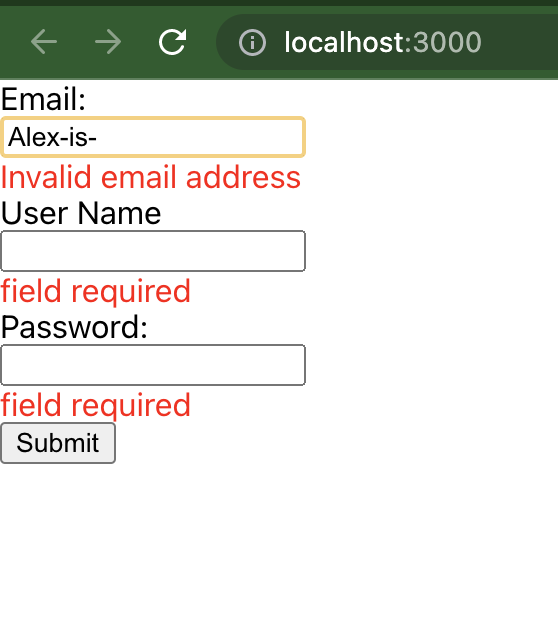

# React Form Validation using Formik

## Description
This project is a simple validation form. It has three fields that are all expect to be filled, if not an error message will display for its respective field. Secondly, the email field will validate that a vaild email was entered. Once all three fields pass the following criteria, an alert on the page will pop up with a sucessful log in notification,

## Installation 
Download a copy of this repo. Open the repo in your favorite code editor and terminal to the project's directory.  Formik is a library that helps take the tedious parts of creating forms. To install Formik, you will need to run this code in the project' terminal directory: 'npm install formik --save'. Now you are ready to run the app in the delvopment mode by using 'npm start,

### `npm start`

Runs the app in the development mode.\
Open [http://localhost:3000](http://localhost:3000) to view it in the browser.

The page will reload if you make edits.\
You will also see any lint errors in the console.

## Usage
This project is an example of a form that is universal across many platforms. It uses React and Formik to create a more concise and logical code.

## Support
[MDN Web Docs](https://developer.mozilla.org/en-US/docs/Web/JavaScript)
This project was bootstrapped with [Create React App](https://github.com/facebook/create-react-app).
You can learn more in the [Create React App documentation](https://facebook.github.io/create-react-app/docs/getting-started).To learn React, check out the [React documentation](https://reactjs.org/). Learn more about Formik in the [Formik documentation](https://formik.org/docs/overview).

## Roadmap
My goal for this project is to continue learning how to use Formik to vaildate password length and character criteria.

## License Information
MIT
